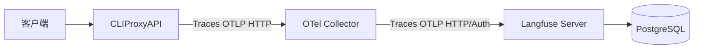

# OpenTelemetry与Langfuse可观测性集成指南

CLIProxyAPI 内置了对 OpenTelemetry (OTel) 的支持，允许你对请求链路进行完整追踪，并配合 [Langfuse](https://langfuse.com/) 等后端进行 Token 用量与延迟分析。

## 快速开始 (Docker Compose)

我们提供了一套完整的 Docker Compose 配置，包含 Langfuse 服务端、PostgreSQL 数据库以及预配置好的 OpenTelemetry Collector。

### 1. 准备配置

复制示例配置文件：
```bash
cp .env.langfuse.example .env.langfuse
```

**配置环境变量：**
编辑 `.env.langfuse` 文件，根据需要调整以下项：
*   `LANGFUSE_PORT`: 设置为你希望访问 Langfuse UI 的端口（默认 `18888`）。
*   `LANGFUSE_AUTH_SECRET` / `LANGFUSE_SALT` / `LANGFUSE_ENCRYPTION_KEY`: **必须填写**。这些是随机字符串，用于保护数据库和会话安全。你可以使用 PowerShell 运行 `[guid]::NewGuid().ToString('N')` 来生成随机串。

**生成认证字符串：**
OTel Collector 需要将密钥编码为 Base64 格式的 Basic Auth Header。
格式为：`public_key:secret_key`

*   **Linux/macOS:**
    ```bash
    echo -n "pk-lf-xxxx:sk-lf-xxxx" | base64
    ```
*   **Windows PowerShell:**
    ```powershell
    [Convert]::ToBase64String([Text.Encoding]::ASCII.GetBytes("pk-lf-xxxx:sk-lf-xxxx"))
    ```

将生成的字符串填入 `.env.langfuse` 文件中的 `LANGFUSE_AUTH_BASE64` 字段。

### 2. 启动服务栈

启动所有服务（必须显式指定环境文件以加载自定义端口和密钥）：
```bash
docker-compose -f docker-compose.langfuse.yml --env-file .env.langfuse up -d
```

### 3. 运行 CLIProxyAPI

你可以使用根目录下的 `Makefile` 快速编译并运行：

```bash
# 编译并启动（会自动设置 OTEL_EXPORTER_OTLP_ENDPOINT 环境变量）
make run
```

或者手动操作：

1. **编译**：
   ```bash
   go build -o CLIProxyAPI.exe ./cmd/server/main.go
   ```

2. **启动**：
   CLIProxyAPI 默认会尝试连接 `127.0.0.1:4318` 发送数据，这正好对应我们启动的 Collector 的 HTTP 接收端口。

如果你的 Collector 在其他地址，可以通过环境变量修改：
```powershell
$env:OTEL_EXPORTER_OTLP_ENDPOINT="192.168.1.100:4318"
./CLIProxyAPI
```

### 4. 验证

发起一个对话请求：
```bash
curl http://localhost:8317/v1/chat/completions ...
```

回到 Langfuse UI 的 **Traces** 页面，你应该能看到一条新的追踪记录。点进去可以看到：
*   **入站请求 (Incoming)**: 客户端发给 CLIProxyAPI 的请求。
*   **出站请求 (Outbound)**: CLIProxyAPI 转发给上游（如 OpenAI/Claude）的请求。
*   **Token 用量**: 输入/输出 Token 统计（需要上游返回标准 Usage 字段）。

## 配置详解

### 环境变量

| 变量名 | 描述 | 默认值 |
| :--- | :--- | :--- |
| `OTEL_SDK_DISABLED` | 设置为 `true` 可完全关闭 OTel 功能。 | `false` |
| `OTEL_EXPORTER_OTLP_ENDPOINT` | OTLP HTTP 上报地址。 | `127.0.0.1:4318` |
| `APP_VERSION` | 应用版本号，会作为 Resource Attribute 上报。 | (空) |

### 常见问题

#### 1. Endpoint 格式问题
Go 的 OTel SDK 对 Endpoint 格式比较严格。
*   ❌ **错误**: `http://localhost:4318/v1/traces` (不要带路径)
*   ✅ **推荐**: `127.0.0.1:4318` (仅 host:port)
*   ℹ️ **兼容**: `http://127.0.0.1:4318` (程序内部会自动处理这种带 scheme 的写法)

#### 2. 为什么看不到数据？
1.  **检查 Collector 日志**:
    ```bash
    docker-compose -f docker-compose.langfuse.yml logs -f otel-collector
    ```
    如果有 401/403 错误，说明 `.env.langfuse` 里的 `LANGFUSE_AUTH_BASE64` 没填对。
2.  **检查网络**: 确保 4318 端口没有被防火墙拦截。
3.  **检查采样率**: 目前默认采样率是 100% (AlwaysSample)，如果请求量巨大可能会被后端限流。

#### 3. 关于环境文件与端口
1.  **显式加载**: 由于 Docker Compose 默认只加载 `.env`，如果你使用 `.env.langfuse`，运行命令时**必须**带上 `--env-file .env.langfuse` 参数，否则 `LANGFUSE_PORT` 等变量将使用默认值（3000）。
2.  **Windows 环境**: Windows 下 Docker Compose 读取环境变量时，**不会**自动执行 shell 命令（如 `$(...)`）。所以必须手动生成 Base64 字符串并填入，不能在 .env 里写脚本。
3.  **密钥缺失**: 如果 `LANGFUSE_AUTH_SECRET` 等密钥未设置，Langfuse 容器可能会启动失败或不断重启，请务必检查日志。

## 进阶架构



这种架构的好处是：
1.  **解耦**: CLIProxyAPI 不需要知道 Langfuse 的具体鉴权方式，只管往标准的 OTel Collector 发。
2.  **缓冲**: Collector 可以作为缓冲层，处理重试、批量发送等。
3.  **灵活**: 以后想换别的监控平台（如 Jaeger, Zipkin），只需改 Collector 配置，不用改代码。
